# Alloygery

Alloygery adds new metals and alloys to change up tools and armor while preserving a vanilla feel

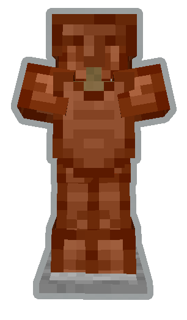
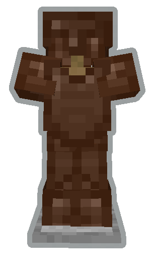
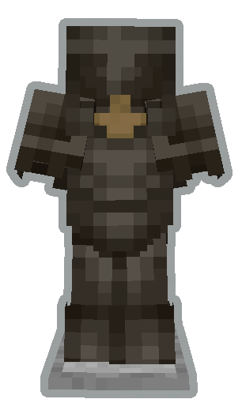
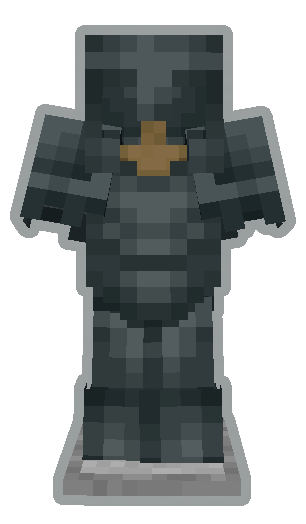

two alloy kilns for processing ores and ingots into alloys

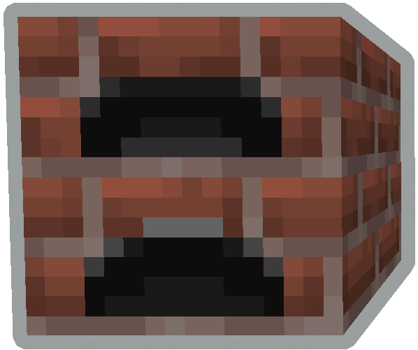
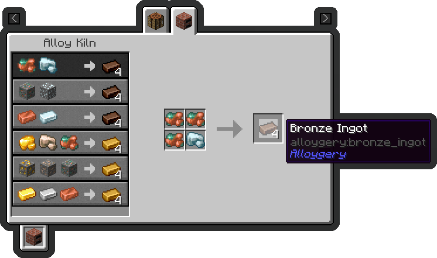

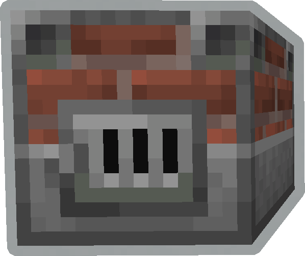
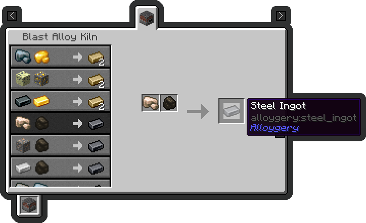

as well as a handful of ores

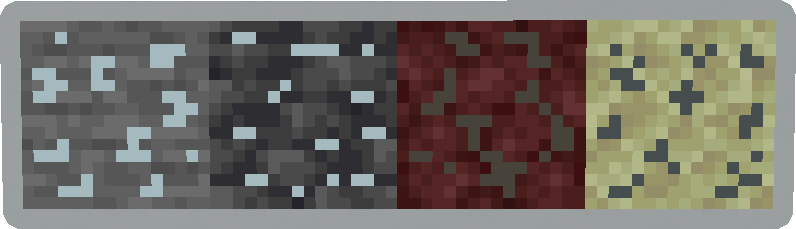

Alloygery also expands the upgrade options at the smithing table

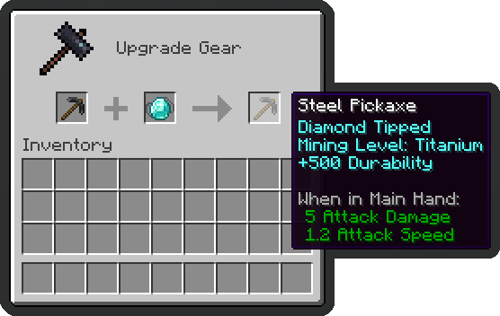
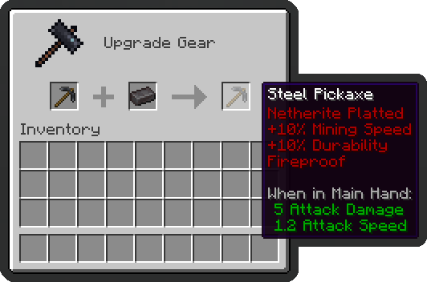
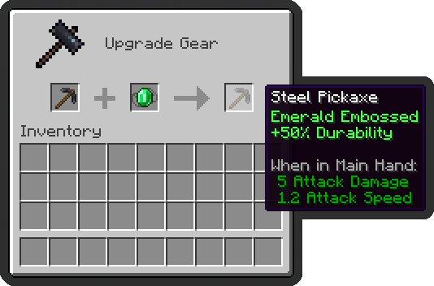

