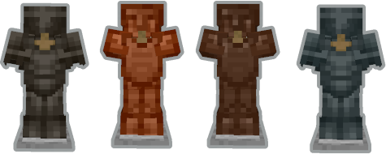
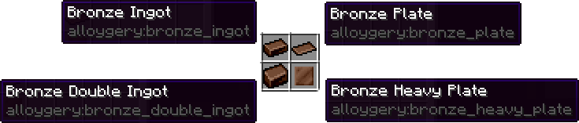
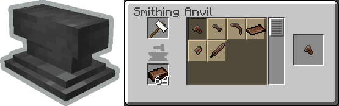
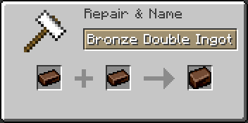

# Alloygery

Alloygery adds new metals and alloys to change up tools and armor while preserving a vanilla feel

<h2 align="left">Extra Materials and Tool Parts</h2>

New feature in development.

Adds extra materials for vanilla and Alloygery metal types:

With the goal of having an alternative way to craft tools and armor, using a new crafting interface

