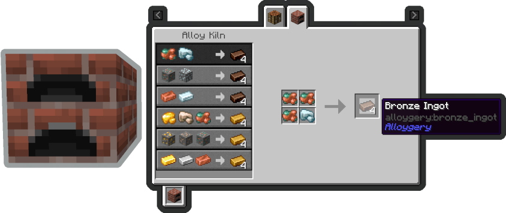
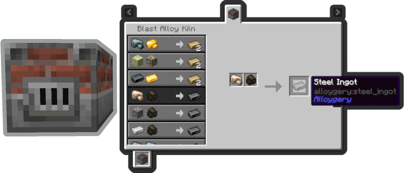
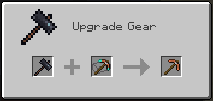
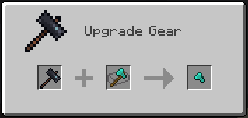

# Alloygery

Alloygery adds new metals and alloys to change up tools and armor while preserving a vanilla feel

The mod adds two kilns to process ores into alloys,

and a new anvil to create tool parts.

Tools are crafted from a combination of a tool head (like a pickaxe head), a binding, and a handle. Where each part contributes to the overall stats of the tool. Try mix and matching materials to get the best results.

Once you have a tool, take it over to the smithing table to apply an upgrade.

Upgrades are removable by using a smithing hammer.

By Default, diamond and netherite gear are uncraftable. If you happen to come across some gear via loot or trading, you can still make use of it by salvaging the tool head.

Similarly, regular gear can also be dismantled this way.

If you have some ideas, or want to talk about Alloygery, consider joining the discord.

