# Alloygery

adding new metals and alloys to change up tools and armor while preserving a vanilla feel

Alloygery adds a way to make alloys from vanilla and Alloygery ores and metals.

The Alloy Kiln

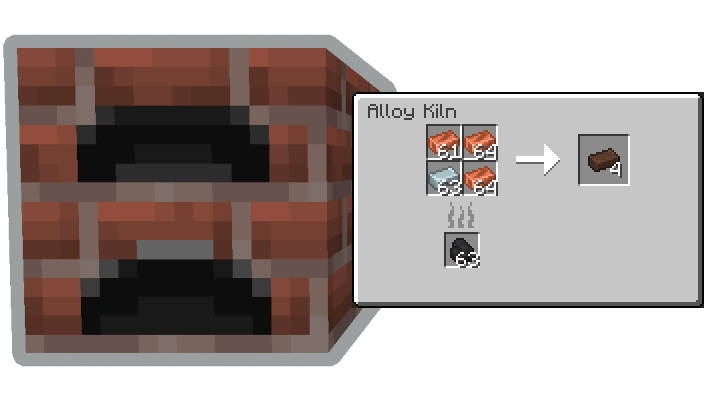

and the Blast Alloy Kiln

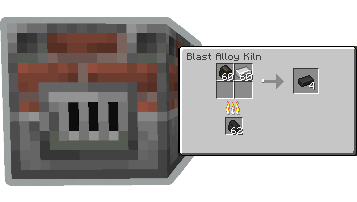

Alloygery introduces a new way to craft tools out of parts made at the Smithing Anvil.

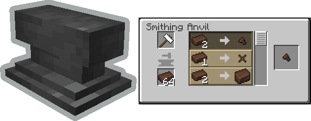

Tool Update Details

Tools are crafted from a combination of a tool head (like a pickaxe head), a binding, and a handle. Where each part contributes to the overall stats of the tool. Try mix and matching materials to get the best results.

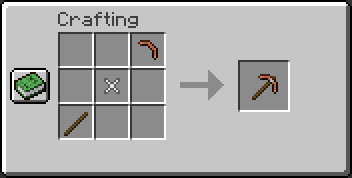

Once you have a tool, take it over to the smithing table to apply an upgrade.

Upgrades are removable by using a smithing hammer.

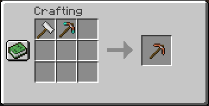

By default, diamond and netherite gear are uncraftable. If you happen to come across some gear via loot or trading, you can still make use of it by salvaging the tool head.

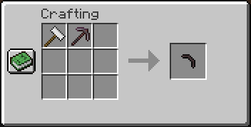

Similarly, regular gear can also be dismantled this way.

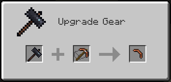

In a similar way to tool crafting, Alloygery also changes the way armor is made.

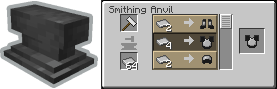

Armor Update Details

Armor starts with a base layer. There are three base layers: Wool, Leather, and Chain.

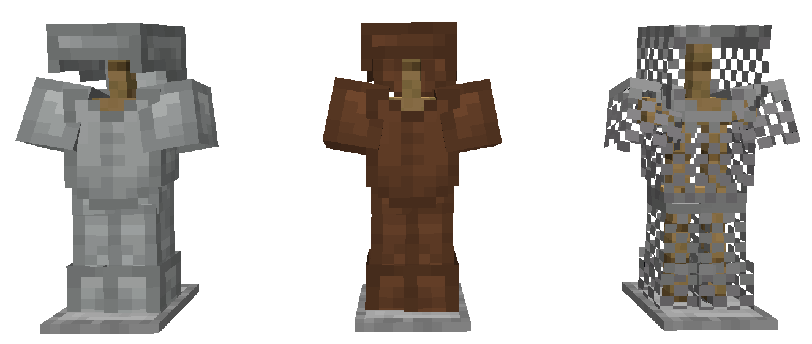

You can craft armor plating to upgrade your armor with at the Smithing Anvil

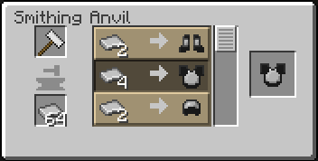

Then apply those upgrades to your base armor at the Smithing Table

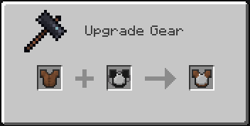

Plating can be removed at the Crafting Table by using a Crafting Hammer

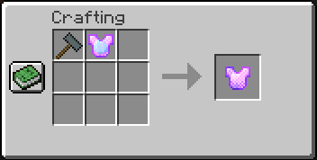

By default, diamond and netherite armor is not craftable. You can make armor plates from any that you find as loot though.

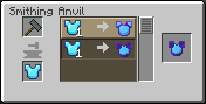

There are two types of armor plating added by Alloygery. Plate, and Heavy Plate.

Depiction of Steel Plate applied to each base armor type.

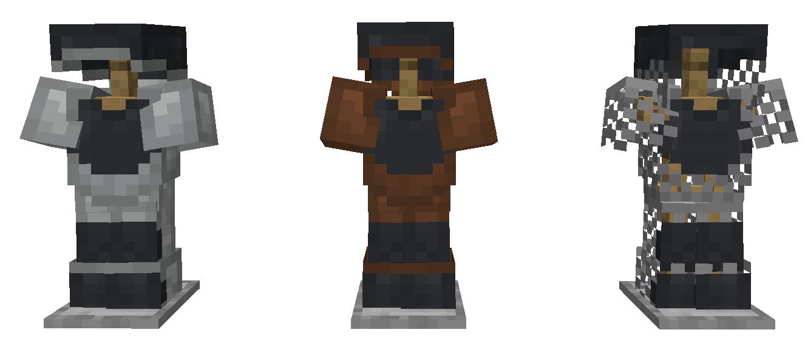

Depiction of Steel Heavy Plate applied to each base armor type.

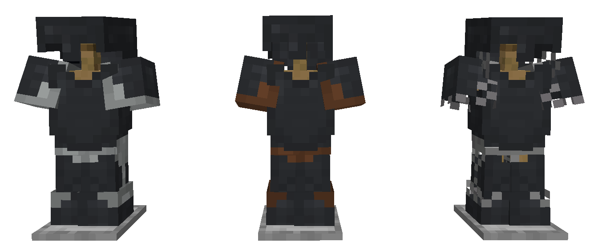

With the ability to dye leather and wool base layers, the possible combinations are extensive.

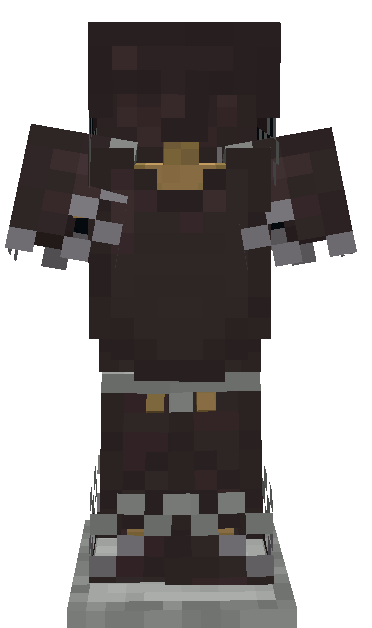

If you have some ideas, or want to talk about Alloygery, consider joining the discord.

