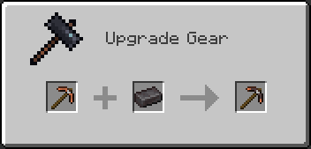

# Alloygery

Alloygery adds new metals and alloys to change up tools and armor while preserving a vanilla feel

<h2 align="left">Extra Materials and Tool Parts</h2>

New feature in development.

Adds extra materials for vanilla and Alloygery metal types, with the goal of having an alternative way to craft tools and armor, using a new crafting interface

Tools are crafted from a combination of a tool head (like a pickaxe head), a binding, and a handle

Alpha builds are available on CurseForge if you want to play with these features. Be aware that the branch is in active development and likely to change, and/or be buggy. Make world backups often.

